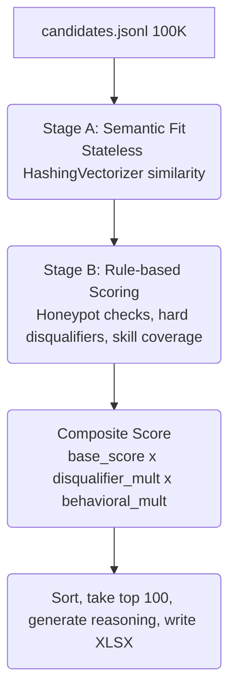

<div align="center">
  <h1>Candidate Ranker</h1>
  <p>An AI-recruiter ranking engine for the <b>Senior AI Engineer — Founding Team</b> role.<br>Built for the <i>India Runs Data & AI Challenge</i>.</p>

  [](https://www.python.org/)
  [](#)
  [](#)
</div>

Given **100,000 candidate profiles**, it produces a ranked top-100 shortlist — fully **offline, CPU-only, no GPU**, in under **20 seconds**.

---

## Quick Start

Get the system up and running in minutes:

```bash
# 1. Install dependencies
pip install -r requirements.txt

# 2. Run the ranking pipeline
python rank.py --candidates ./candidates.jsonl --out ./output/team_OverClock.xlsx
```

> **⚡ Performance Note:** That's it — one command, no network access required, no GPU. On a 12-core Windows laptop, this completes in **under 20 seconds** for the full 100K-candidate dataset, utilizing a hyper-optimized byte-offset multiprocessing architecture with `orjson` for fast JSON parsing (well under the 5-minute budget).

**To validate the output before submitting:**
```bash
python validate_submission.py output/team_OverClock.xlsx
```

**To explore the ranker interactively (sandbox demo):**
```bash
https://team-over-clock-hackathon.streamlit.app/
```

---

## 🎯 The Problem

Traditional keyword filters reject good candidates whose resumes don't use the "right" buzzwords, and accept bad candidates who stuff their skills list with trendy keywords regardless of what they actually did. 

The JD for this role explicitly calls this out — it asks for **semantic understanding of actual experience**, not keyword matching, while also requiring the system to **catch keyword-stuffers, inconsistent/fake profiles, and unavailable candidates.**

The dataset is built to test exactly this: it contains [honeypot profiles](#-honeypot--consistency-check) with impossible internal inconsistencies, and a realistic mix of strong-but-buzzword-light candidates next to weak-but-keyword-stuffed ones.

---

## 💡 Why This Architecture?

The single hardest constraint in this challenge is **no network access, no GPU, 5-minute budget, on 100,000 candidates.** That rules out calling a hosted LLM per-candidate at ranking time.

We landed on a **hybrid rule-engine + local-semantic-similarity** approach:

1. 📏 **Objective Rules:** Things that are **rule-derivable** from the JD's explicit instructions (e.g., "no pure-research-only backgrounds") are encoded as deterministic rules — fast, auditable, and traceable to the JD.
2. 🧠 **Semantic Understanding:** Things requiring meaning (e.g., "this person never says RAG but built a recommendation system") use a **stateless HashingVectorizer** for semantic similarity. It's a classical, fully local, deterministic technique that captures conceptual similarity and scales perfectly across all CPU cores.
3. 🤝 **Behavioral Signals:** Applied as a separate multiplicative layer, per the JD's explicit instruction that a perfect-on-paper but unreachable candidate should rank lower.

Every score the system produces can be explained in one sentence — critical for the `reasoning` column requirement and for defending the system in a live interview.

---

## ⚙️ Pipeline Architecture



### 📁 File-by-file Breakdown

| File | Purpose |
|---|---|
| `config.py` | 🛠️ **The Brains.** The JD's requirements encoded as structured data — skill families, nice-to-haves, hard disqualifier rules, honeypot thresholds, location/experience preferences, and the "ideal candidate" reference text. **No logic lives here, only judgment calls**. |
| `scoring.py` | 🧮 **The Engine.** All scoring mechanics: honeypot detection, disqualifier rule checks, semantic similarity (HashingVectorizer), behavioral multipliers, and reasoning generation. |
| `rank.py` | 🚀 **The Orchestrator.** Single entry point. Loads candidates, runs the scoring pipeline, ranks, and writes the submission XLSX. |
| `app.py` | 🖥️ **The UI.** Streamlit sandbox demo — runs the exact same pipeline on a small sample interactively. |
| `validate_submission.py` | ✅ **The Validator.** Provided by organizers to validate output format. |

---

## 🔍 Methodology in Detail

### 1. JD Interpretation (`config.py`)
We translated explicit JD statements into structured rules. For example:
- *Entire career at consulting/services firms* 📉 **Penalty**
- *Pure research background with no production evidence* 🚫 **Heavy Penalty** (JD: "will not move forward")
- *Job-hopping pattern* 📉 **Penalty**

### 2. Semantic Fit
We concatenate each candidate's profile text and compare it against an "ideal candidate" paragraph using a **highly-optimized HashingVectorizer** and cosine similarity. It runs across all CPU cores simultaneously via a **byte-offset multiprocessing** architecture, bypassing the Python GIL.

### 3. Honeypot & Consistency Check
We built detection rules for internally-impossible profiles:
- 🚨 Expert proficiency claimed with near-zero `duration_months`.
- 🚨 Career-history total duration far exceeding stated `years_of_experience`.
- 🚨 Claimed proficiency level far above the candidate's actual tested `skill_assessment_scores`.

*(In testing, this kept the final top-100 shortlist at **0 honeypots**).*

### 4. Behavioral Availability Multiplier
Combines `recruiter_response_rate`, recency of `last_active_date`, `open_to_work_flag`, and `interview_completion_rate` into a single multiplier (0.30x to 1.10x).

### 5. Reasoning Generation
Each top-100 candidate gets a reasoning sentence built from their *actual* deciding factors (semantic score, skills matched, role relevance), rather than a fixed template.

---

## 📊 Results (Full 100K-candidate Run)

- ⏱️ **Runtime:** `< 20 seconds` end-to-end *(Budget: 5 minutes)*
- 🍯 **Honeypots in final top-100:** `0 / 100`
- ✅ **Validation:** Passes `validate_submission.py` with no errors
- 🌟 **Quality:** Top-ranked candidates are consistently real ML/AI/Search/Recommendation engineers at credible product companies.

---

## ⚖️ Design Tradeoffs & Limitations

- **HashingVectorizer vs. Neural Embeddings:** We chose a stateless classical approach over a downloaded sentence-transformer model to guarantee **zero network dependency** at ranking time and allow **perfect multi-core scaling**.
- **Multiplicative Penalties:** Disqualifiers apply a penalty multiplier rather than a hard reject (except honeypots), aligning with the JD's softer "probably won't move forward" language.
- **Honeypot Precision vs. Recall:** We purposely over-flag borderline profiles to ensure no true honeypot slips into the top 100.

---

## 👥 Team

Built by a 3-person team. See `submission_metadata.yaml` for contact and compute details, and an honest declaration of how AI tools were used during development.
