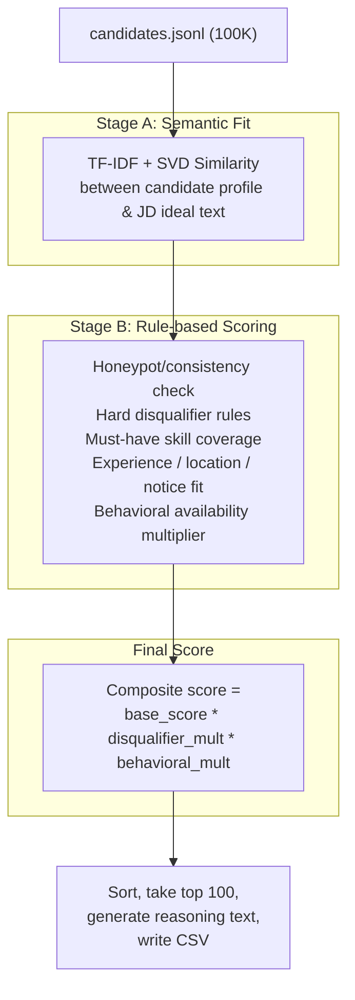

<div align="center">
  
# 🏆 Candidate Ranker

*An AI-recruiter ranking engine for the **Senior AI Engineer — Founding Team** role.*
*Built for the **India Runs Data & AI Challenge**.*

[](https://www.python.org/)
[](https://opensource.org/licenses/MIT)
[]()
[]()

Given **100,000 candidate profiles**, it produces a ranked **top-100 shortlist** — fully **offline, CPU-only, no GPU**, in under two minutes. 🚀

</div>

---

## ⚡ Quick Start

Get up and running with a single command. No network access required, no GPU needed.

```bash
pip install -r requirements.txt
python rank.py --candidates ./candidates.jsonl --out ./output/team_xxx.csv
```

> **Performance Note:** On a standard 6-core / 16GB laptop, this completes in **~90-115 seconds** for the full 100K-candidate dataset (well under the 5-minute budget limit). ⏱️

### 🧪 Validation & Demo

To validate the output before submitting:
```bash
python validate_submission.py output/team_xxx.csv
```

To explore the ranker interactively (small-sample sandbox demo):
```bash
# Streamlit Sandbox App
https://over-clock-hackathon-biqdfrsmxerqsesy47mvmr.streamlit.app/
```

---

## 🎯 The Problem

Traditional keyword filters are broken. They **reject** good candidates whose resumes lack the "right" buzzwords, and **accept** bad candidates who simply stuff their skills list with trendy keywords. 

The JD for this role explicitly calls this out — it asks for **semantic understanding of actual experience**, not keyword matching, while also requiring the system to **catch keyword-stuffers, inconsistent/fake profiles, and unavailable candidates.**

This dataset is built to test exactly this:
- It contains [honeypot profiles](#-honeypot-consistency-check) with impossible internal inconsistencies.
- It features a realistic mix of strong-but-buzzword-light candidates next to weak-but-keyword-stuffed ones.

---

## 🧠 Why This Architecture?

The single hardest constraint in this challenge is:
**No network access. No GPU. 5-minute budget. 100,000 candidates.**

That rules out calling a hosted LLM per-candidate at ranking time. The obvious "just ask an AI" path isn't viable here, by design. The system had to be built as something a real recruiting platform could actually run in production: **fast, explainable, and cheap per query**.

We landed on a **hybrid rule-engine + local-semantic-similarity** approach:

1. 📜 **Objective Rules:** Things that are rule-derivable from the JD's explicit instructions (e.g., "no pure-research-only backgrounds") are encoded as deterministic rules — fast, auditable, and directly traceable to the job description.
2. 🔍 **Semantic Understanding:** Things that require understanding meaning (e.g., "this person's resume never says RAG but their work history is clearly a recommendation system") are handled by **TF-IDF + truncated SVD (LSA) semantic similarity** — a classical, fully local, deterministic technique that captures conceptual similarity without needing a downloaded neural model.
3. 🤝 **Behavioral Signals:** Behavioral/availability signals are applied as a separate multiplicative layer on top, per the JD's explicit instruction that a perfect-on-paper but unreachable candidate should rank lower.

This means **every score the system produces can be explained in one sentence** — important both for the `reasoning` column requirement and for being able to defend the system in a live interview.

---

## 🏗️ Pipeline Architecture



### 📁 File-by-File Breakdown

| File | Purpose |
|---|---|
| ⚙️ `config.py` | The JD's requirements encoded as structured data (must-haves, disqualifiers, composite scoring weights). **No logic lives here, only judgment calls**. |
| 🧮 `scoring.py` | All scoring mechanics: honeypot detection, disqualifier checks, TF-IDF/SVD similarity, and reasoning text generation. Pure functions, no I/O. |
| 🚀 `rank.py` | Orchestration — single entry point. Loads candidates, runs the pipeline, ranks, writes the submission CSV. |
| 🎨 `app.py` | Streamlit sandbox demo — runs the exact same pipeline on a small sample interactively. |
| ✅ `validate_submission.py` | Provided by organizers — validates output format. |

---

## 🔬 Methodology in Detail

### 1️⃣ JD Interpretation (`config.py`)
We translated explicit JD statements into structured rules. For example, hard dealbreakers include:
- 🏢 Entire career at consulting/services firms → *Penalty*
- 🧪 Pure research background with no deployment evidence → *Heaviest penalty (JD: "will not move forward")*
- 🦜 "AI experience" limited to recent LangChain wrappers → *Penalty*
- 👔 Senior title with no hands-on coding in 18+ months → *Penalty*

Each rule applies its own **multiplicative penalty** (except honeypots, which force a near-zero score). 

### 2️⃣ Semantic Fit (`scoring.compute_semantic_scores`)
We compare each candidate's concatenated profile text against an "ideal candidate" paragraph using **TF-IDF vectorization (unigrams + bigrams) followed by truncated SVD (LSA)** and cosine similarity. 
- Computed **once, in batch, across all 100K candidates**.
- This lets a candidate score well even if their resume lacks exact keywords like "RAG", while correctly demoting keyword-stuffers.

### 3️⃣ Honeypot / Consistency Check
We built detection rules based on real data anomalies:
1. 📈 **Expert proficiency claimed** with near-zero `duration_months`.
2. ⏳ **Career history total duration** far exceeding stated `years_of_experience`.
3. 🥇 **Claimed proficiency level** far above the candidate's tested `skill_assessment_scores`.

> **Result:** Any candidate matching these is pushed to a near-zero score, keeping the final top-100 shortlist at **0 honeypots**.

### 4️⃣ Behavioral Availability Multiplier
Combines `recruiter_response_rate`, `last_active_date`, `open_to_work_flag`, and `interview_completion_rate` into a single multiplier (0.30x to 1.10x), ensuring reachable candidates are prioritized.

### 5️⃣ Reasoning Generation
Each top-100 candidate gets a dynamically generated reasoning sentence built from their *actual* deciding factors (semantic score, skills matched, availability).

---

## 📊 Results (Full 100K Run)

- ⏱ **Runtime:** ~93-115 seconds end-to-end (budget: 5 minutes)
- 🪤 **Honeypots in final top-100:** 0 / 100
- ✅ **Output:** Passes `validate_submission.py` flawlessly
- 🏆 **Quality:** Top-ranked candidates are consistently real ML/AI/Search engineers at credible product companies.

---

## ⚖️ Design Tradeoffs & Limitations

- **TF-IDF/SVD vs. Neural Embeddings:** We chose classical TF-IDF+SVD over a sentence-transformer model to guarantee **zero network dependency** at ranking time. This trades some semantic nuance for total reproducibility.
- **Multiplicative Penalties:** Disqualifier penalties are multiplicative, not hard rejects (except honeypots), based on the JD's softer "probably won't move forward" language.
- **Honeypot Detection:** We trade precision for recall — we'd rather over-flag borderline profiles than let a true honeypot slip into the top 100.

---

## 👥 Team

Built by a 3-person team. See `submission_metadata.yaml` for contact and compute details, and an honest declaration of how AI tools were used during development.

<div align="center">
  <i>Made with 💡 for the India Runs Data & AI Challenge</i>
</div>
